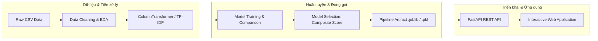

# ASSIGNMENT 02 – PHÁT TRIỂN CÁC HỆ THỐNG THÔNG MINH
## End-to-End Machine Learning Systems (Pipeline, Web Apps & REST APIs)

[](https://www.python.org/)
[](https://scikit-learn.org/)
[](https://fastapi.tiangolo.com/)
[](https://portal.ptit.edu.vn/)

---

### 👤 Thông tin sinh viên thực hiện
- **Họ và tên**: **Trần Văn Hậu**
- **Mã sinh viên**: **B23DCCN287**
- **Lớp**: **D23CQCN01-B**
- **Giảng viên hướng dẫn**: **PGS. TS. Trần Đình Quế**
- **Học viện**: Học viện Công nghệ Bưu chính Viễn thông (PTIT) – Khoa Công nghệ Thông tin 1
- **GitHub Repository**: [https://github.com/TrVHau/A2_CT_hautv.287](https://github.com/TrVHau/A2_CT_hautv.287)

---

## 📌 Tổng quan dự án

Repository này chứa **ba hệ thống học máy thông minh hoàn chỉnh**, được xây dựng từ dữ liệu thô đến triển khai ứng dụng thực tế theo chuẩn quy trình công nghiệp:

$$\text{Dữ liệu thô} \xrightarrow{\text{Làm sạch \& EDA}} \text{Biểu diễn } \mathbf{x}_i \in \mathbb{R}^d \xrightarrow{\text{Huấn luyện \& Đánh giá}} \text{Lưu Pipeline Artifact} \xrightarrow{\text{FastAPI REST API}} \text{Web Client UI}$$



---

## 🏆 Bảng tổng hợp 3 Ứng dụng Machine Learning

| Ứng dụng | Loại bài toán | Dữ liệu đầu vào | Không gian đặc trưng $\mathbf{x}_i$ | Mô hình lựa chọn tối ưu | Hiệu năng trên Test Set | Endpoint triển khai |
|---|---|---|---|---|---|---|
| **1. Diabetes Prediction** | Phân loại nhị phân (*Binary Classification*) | `diabetes_prediction_dataset.csv`<br>(100,000 bản ghi) | $d = 15$<br>(Chuẩn hóa Z-Score + OHE) | **Random Forest Classifier**<br>(Tối ưu dữ liệu mất cân bằng) | **Accuracy: 97.2%**<br>**F1-Score: 81.3%**<br>**ROC-AUC: 96.1%** | `POST /predict`<br>`GET /health` |
| **2. House Price Prediction** | Hồi quy giá trị liên tục (*Regression*) | `VN_housing_dataset.csv`<br>(30,229 quan sát) | $d = 11$<br>(RobustScaler + OHE) | **Random Forest Regressor**<br>(Chống chịu ngoại lệ cao) | **MAE: 1.46 tỷ**<br>**RMSE: 1.85 tỷ**<br>**$R^2$: 0.2997** | `POST /predict`<br>`GET /health` |
| **3. Customer Behavior** | Phân loại đa phương thức (*Multimodal Classification*) | `Womens Clothing Reviews.csv`<br>(23,486 đánh giá) | $d = 1,038$<br>(TF-IDF 1,000 + Tabular 38) | **Logistic Regression (Balanced)**<br>(Multimodal Fusion) | **Accuracy: 93.3%**<br>**F1-Score: 95.8%**<br>**ROC-AUC: 97.7%** | `POST /predict`<br>`GET /health` |

---

## 📁 Cấu trúc thư mục dự án

```text
assignment2/
├── README.md                                          # Tài liệu hướng dẫn tổng quan dự án
├── report/                                            # Báo cáo tổng kết môn học
│   ├── Bao_cao_BTL_Tran_Van_Hau_B23DCCN287.docx       # Báo cáo Word chuẩn mẫu (PTIT)
│   ├── Bao_cao_BTL_Tran_Van_Hau_B23DCCN287.md         # Báo cáo định dạng Markdown
│   └── example.docx                                   # Báo cáo tham khảo gốc
│
├── diabetes/                                          # ỨNG DỤNG 1: DỰ ĐOÁN TIỂU ĐƯỜNG
│   ├── data/
│   │   └── diabetes_prediction_dataset.csv            # Bộ dữ liệu 100,000 bệnh nhân
│   ├── notebook/
│   │   └── diabetes_prediction.ipynb                  # Notebook đầy đủ 23 Sections + 29 biểu đồ
│   ├── models/
│   │   ├── diabetes_pipeline.joblib                   # Pipeline hoàn chỉnh (18.3 MB)
│   │   └── fig_*.png                                  # 28 biểu đồ trực quan hóa cao cấp
│   └── web/
│       ├── app.py                                     # FastAPI REST API Backend
│       └── index.html                                 # Giao diện Web Client tương tác
│
├── house_price/                                       # ỨNG DỤNG 2: DỰ ĐOÁN GIÁ NHÀ
│   ├── VN_housing_dataset.csv                         # Bộ dữ liệu 30,229 tin bất động sản
│   ├── notebook/
│   │   └── house_price_prediction.ipynb               # Notebook 23 Sections phân tích hồi quy
│   ├── models/
│   │   ├── house_price_model.pkl                      # Pipeline hồi quy Random Forest
│   │   └── model_metadata.pkl                         # Metadata cấu hình mô hình
│   └── web/
│       ├── app.py                                     # FastAPI REST API Backend
│       └── index.html                                 # Giao diện Web Client định giá nhà
│
└── customer_behavior/                                 # ỨNG DỤNG 3: HÀNH VI KHÁCH HÀNG (MULTIMODAL)
    ├── Womens Clothing E-Commerce Reviews.csv         # Bộ dữ liệu 23,486 đánh giá thương mại điện tử
    ├── notebook/
    │   └── customer_behavior.ipynb                    # Notebook Multimodal (Text TF-IDF + Tabular)
    ├── models/
    │   ├── customer_behavior_pipeline.joblib          # Pipeline Multimodal End-to-End
    │   └── fig_*.png                                  # 28 biểu đồ trực quan hóa cao cấp
    └── web/
        ├── app.py                                     # FastAPI REST API Backend
        └── index.html                                 # Giao diện Web Client phân tích Review
```

---

## ⚙️ Yêu cầu môi trường & Cài đặt

Dự án được xây dựng và kiểm thử hoàn toàn trên môi trường **Python 3.11** và **Conda**.

### 1. Tạo và kích hoạt môi trường Conda
```bash
# Tạo môi trường assignment2 với Python 3.11
conda create -n assignment2 python=3.11 -y

# Kích hoạt môi trường
conda activate assignment2
```

### 2. Cài đặt các thư viện cần thiết
```bash
pip install numpy pandas scikit-learn matplotlib seaborn joblib scipy \
            fastapi uvicorn pydantic jupyterlab ipykernel python-docx
```

---

## 🚀 Hướng dẫn chạy Notebooks & Tái lập mô hình (Reproducibility)

Tất cả các notebook đều được thiết kế độc lập, tuân thủ nguyên tắc **chống rò rỉ dữ liệu (*Data Leakage Prevention*)**: toàn bộ tiền xử lý (`StandardScaler`, `OneHotEncoder`, `TfidfVectorizer`) chỉ được `fit` trên tập huấn luyện (`X_train`) và cố định `RANDOM_STATE = 42`.

### Chạy Notebook trên JupyterLab:
```bash
# Mở JupyterLab từ thư mục gốc
jupyter lab
```

### Hoặc thực thi tự động toàn bộ qua dòng lệnh:
```bash
# 1. Chạy Diabetes Prediction Notebook
jupyter nbconvert --to notebook --execute --inplace \
  diabetes/notebook/diabetes_prediction.ipynb

# 2. Chạy House Price Prediction Notebook
jupyter nbconvert --to notebook --execute --inplace \
  house_price/notebook/house_price_prediction.ipynb

# 3. Chạy Customer Behavior Prediction Notebook
jupyter nbconvert --to notebook --execute --inplace \
  customer_behavior/notebook/customer_behavior.ipynb
```

---

## 🌐 Hướng dẫn khởi chạy Web App & REST API

Mỗi ứng dụng được đóng gói cùng một FastAPI server kèm giao diện Web HTML5/CSS3 tương tác thời gian thực.

### 1. Ứng dụng Dự đoán Tiểu đường (Diabetes Prediction)
```bash
cd diabetes/web
uvicorn app:app --host 0.0.0.0 --port 8000 --reload
```
- **Giao diện Web**: [http://localhost:8000](http://localhost:8000)
- **Tài liệu API Swagger**: [http://localhost:8000/docs](http://localhost:8000/docs)
- **Endpoint dự đoán**: `POST http://localhost:8000/predict`

*Ví dụ gửi dữ liệu kiểm tra qua `curl`:*
```bash
curl -X POST "http://localhost:8000/predict" \
  -H "Content-Type: application/json" \
  -d '{
    "gender": "Male",
    "age": 65.0,
    "hypertension": 1,
    "heart_disease": 1,
    "smoking_history": "current",
    "bmi": 32.5,
    "HbA1c_level": 7.2,
    "blood_glucose_level": 200
  }'
```

---

### 2. Ứng dụng Dự đoán Giá nhà (House Price Prediction)
```bash
cd house_price/web
uvicorn app:app --host 0.0.0.0 --port 8001 --reload
```
- **Giao diện Web**: [http://localhost:8001](http://localhost:8001)
- **Tài liệu API Swagger**: [http://localhost:8001/docs](http://localhost:8001/docs)
- **Endpoint dự đoán**: `POST http://localhost:8001/predict`

---

### 3. Ứng dụng Dự đoán Hành vi Khách hàng (Customer Behavior Prediction)
```bash
cd customer_behavior/web
uvicorn app:app --host 0.0.0.0 --port 8002 --reload
```
- **Giao diện Web**: [http://localhost:8002](http://localhost:8002)
- **Tài liệu API Swagger**: [http://localhost:8002/docs](http://localhost:8002/docs)
- **Endpoint dự đoán**: `POST http://localhost:8002/predict`

*Ví dụ gửi văn bản đánh giá qua `curl`:*
```bash
curl -X POST "http://localhost:8002/predict" \
  -H "Content-Type: application/json" \
  -d '{
    "age": 32,
    "rating": 5,
    "positive_feedback_count": 12,
    "division_name": "General",
    "department_name": "Dresses",
    "class_name": "Dresses",
    "title": "Absolutely stunning dress!",
    "review_text": "The fabric is high quality, fit is perfection and I received endless compliments."
  }'
```

---

## 📑 Báo cáo tổng kết môn học

Báo cáo đầy đủ và chi tiết (gồm 11 bảng so sánh, 23 hình ảnh biểu đồ phân tích và giao diện kiểm thử) được lưu trữ tại thư mục [`report/`](report/):
- 📘 **Bản Word (.docx)**: [`report/Bao_cao_BTL_Tran_Van_Hau_B23DCCN287.docx`](report/Bao_cao_BTL_Tran_Van_Hau_B23DCCN287.docx)
- 📝 **Bản Markdown (.md)**: [`report/Bao_cao_BTL_Tran_Van_Hau_B23DCCN287.md`](report/Bao_cao_BTL_Tran_Van_Hau_B23DCCN287.md)

---

## 🔒 Bản quyền & Miễn trừ trách nhiệm
- Dự án được thực hiện nhằm mục đích học tập và nghiên cứu trong khuôn khổ học phần **Phát triển các hệ thống thông minh** tại **Học viện Công nghệ Bưu chính Viễn thông**.
- Các dự đoán mang tính hỗ trợ tham khảo, không thay thế cho các chẩn đoán y tế chuyên khoa hay định giá pháp lý bất động sản thực tế.
